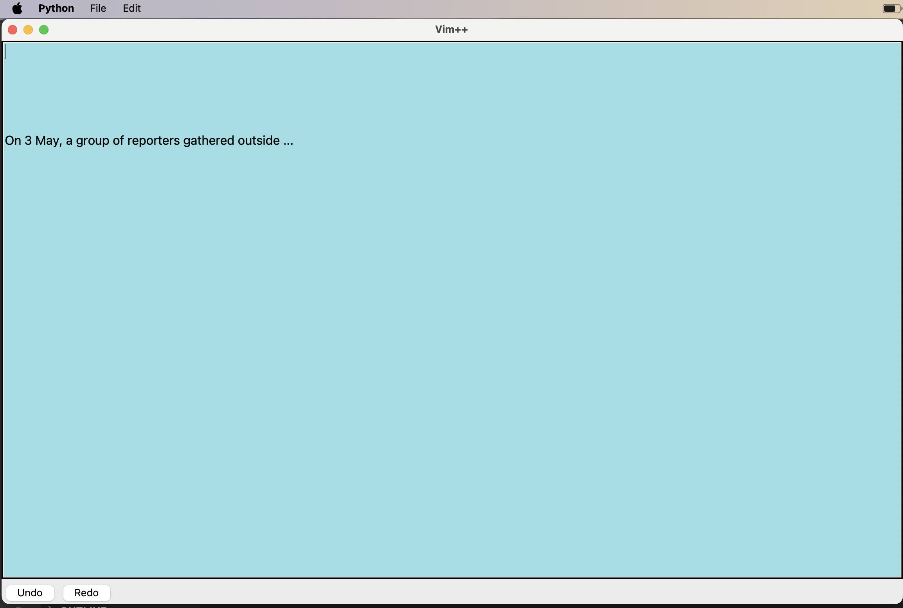

# Vim++ 
A fun attempt to customise a text editor to suit my editing needs. Developed using Python and Tkinter. Its function keys are more towards Windows rather than Vim. 

## Features
- Copy <Command-c>
- Paste <Command-v>
- Undo <Command-z>
- Redo <Command-y> 

